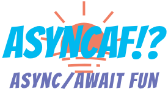

<!--  -->

 

README in progress...come back another time to lay eyes on the most beautiful documentation you've ever seen! 😍

In the meantime, <a href="https://async-af.js.org/AsyncAF" target="_blank">
  check out the docs!
</a> 🚀

Or, [see how to contribute.](https://github.com/AsyncAF/AsyncAF/blob/master/CONTRIBUTING.md) 💙

## Installation 💾

Easy peazy, just `$ npm install --save async-af`, right?

 ⚠️ Not so fast; there's actually many ways to include AsyncAF in your project/production site from easy to more complex:

Easy 👍
 
🔹 <strong>npm:</strong> <code>$ npm install --save async-af</code>

🔸 <strong>yarn:</strong> <code>$ yarn add async-af</code>

🔹 <strong>bower:</strong> <code>async-af</code> is no longer published to bower. To continue using it with bower, look into <a href=https://github.com/mjeanroy/bower-npm-resolver><code>bower-npm-resolver</code></a>.

🔸 <strong>cdn:</strong> See the table for which script tag to use:
<table align=left><th>mode</th><th>browsers</th><th>script tag</th>
<tr><td>development</td><td>modern (ES6+)</td><td><code>&lt;script src="https&#58;//unpkg.com/async-af/index.js">&lt;/script></code></td></tr>
<tr><td>development</td><td>legacy (ES5+)</td><td><code>&lt;script src="https&#58;//unpkg.com/async-af/legacy/index.js">&lt;/script></code></td></tr>
<tr><td>production</td><td>modern (ES6+)</td><td><code>&lt;script src="https&#58;//unpkg.com/async-af/min.js">&lt;/script></code></td></tr>
<tr><td>production</td><td>legacy (ES5+)</td><td><code>&lt;script src="https&#58;//unpkg.com/async-af/legacy/min.js">&lt;/script></code></td></tr>
</table> 

 

More Complex 🤔
 

🔹 <strong>using scoped packages:</strong>

> 
Instead of pulling in the entire AsyncAF library, you can install smaller standalone packages for each of the AsyncAF methods you intend to use; for example, <code>@async-af/map</code> and/or <code>@async-af/filter</code>; see further instructions in the documentation for <a href="https://async-af.js.org/AsyncAfWrapper" target=_blank>AsyncAfWrapper</a> and <a href="https://async-af.js.org/AsyncAfWrapper#use" target=_blank>AsyncAfWrapper.use</a>.

🔸 <strong>using scoped packages + `babel-plugin-transform-imports`:</strong>

>
If you use more than few AsyncAF scoped packages in a file, you might start to build a wall of `import` statements to pull them all in. If this is an eyesore for you, look into <a href="https://www.npmjs.com/package/babel-plugin-transform-imports" target="_blank"><code>babel-plugin-transform-imports</code></a> and condense that ugly wall down to a single `import` statement! See <a href="https://async-af.js.org/tutorial-TOO_MANY_IMPORTS" target=_blank>Wrapper/Use: Too Many 🤬 Imports!?</a> for a tutorial.

 

## License
AsyncAF is licensed under the [MIT License](https://choosealicense.com/licenses/mit/), so you can pretty much use it however you want

(but [click here](https://github.com/AsyncAF/AsyncAF/blob/master/LICENSE) or [here](https://app.fossa.io/projects/git%2Bgithub.com%2FAsyncAF%2FAsyncAF/refs/branch/master/) to get into specifics).

